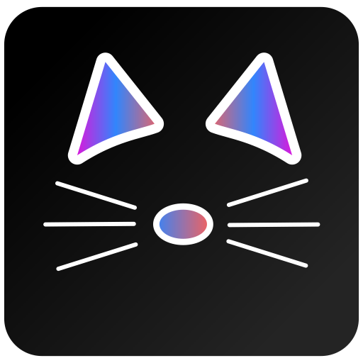

<h1 style="text-align: center; position:relative; height: 150px">

AniHub (Alpha)

Your favorite streaming app.

</h1>

  

## **Anihub** is a streaming app that allows you to watch/read your favorite anime and manga online. It is built with Electron and Vite, and is available for Windows, macOS, and Linux. 

Any enterprise can make a plugin for this application and distribute it to the community. The ads should be passed by the plugin to the player together to the content for monetization. This app is intended to be a way to unify the anime and manga streaming experience into a single platform, enhancing the user experience and providing a more seamless way to access their favorite content.

## Features

- **Anime Streaming**: Does support modern streaming protocols, such as HLS and DASH + simple video files.
- **Manga Reader**: We have a simple manga reader (still under development, but it works).
- **Plugin Support**: currently supports only python plugins (under devolpment, but works). Future versions will support JS/TS and compiled binaries.

